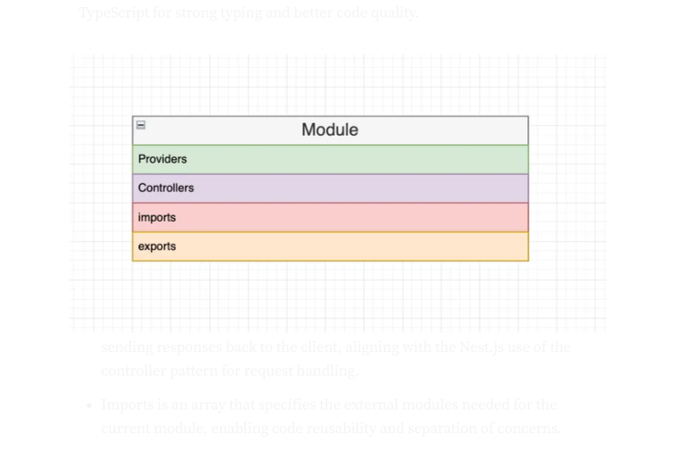
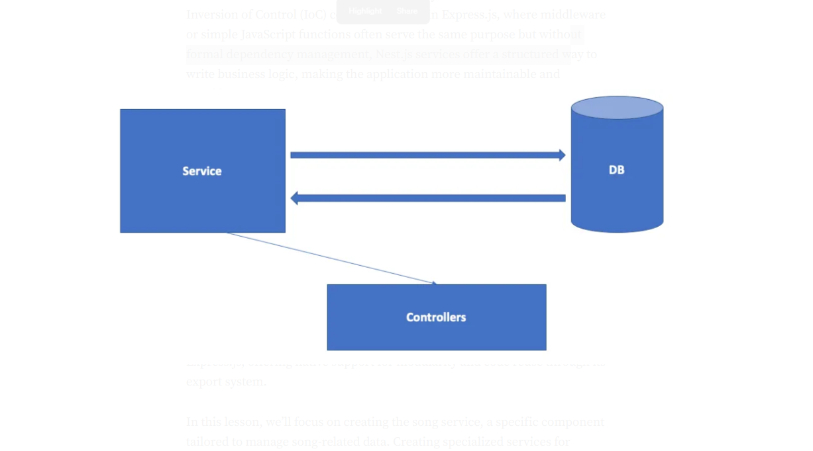

# Getting Started with NestJS
## Project Structure

NestJS follows a modular architecture, which is used to this architecture follows the “Module Isolation” principle, ensuring that the application is organized into distinct functional or feature-based modules.



- Each Module encapsulates Providers, Controllers, Imports, and Exports, acting as a cohesive unit of related functionality.

- Providers in Nest.js are classes that act as services, factories, or repositories. They encapsulate business logic and can be injected into controllers or other services.

- Controllers serve the function of handling incoming HTTP requests and sending responses back to the client, aligning with the Nest.js use of the controller pattern for request handling.

- Imports is an array that specifies the external modules needed for the current module, enabling code reusability and separation of concerns.

- Exports are utilized to make services available to other modules, aligning with the Nest.js emphasis on encapsulation and modular design.


## Project Structure 

- The main.ts file serves as the entry point for the application and employs the core function NestFactory to instantiate a Nest application. 

- app.controller.ts: This is a basic controller file containing a single route. Controllers in Nest.js are responsible for request handling and response sending, acting as a gateway between client and server.

- app.controller.spec.ts: This file contains unit tests for the controller, adhering to the Nest.js focus on test-driven development (TDD).

- app.module.ts: This is the root module of the application, which imports other modules and providers. Nest.js modules act as organizational units and follow the Single Responsibility Principle.

- app.service.ts: A basic service file with a single method. In Nest.js, services encapsulate business logic and can be injected into controllers, promoting Dependency Injection and the Separation of Concerns.

- nest-cli.json: Utilized for Nest.js-specific configurations, this file allows customization of compiler options, assets, and other settings.

- .prettierrc: This file is used for configuring Prettier, aiding in code formatting and style consistency within the Nest.js project.

- tsconfig.json: This configuration file is for TypeScript and determines how the TypeScript compiler will behave. This aligns with Nest.js’s use of TypeScript for strong typing and better code quality.

### Data Transfer Object: `dto/create-user.dto.ts`

```typescript
export class CreateUserDto {
  id: number;
  name: string;
  age: number;
}
```

### Main Application Module: `app.module.ts`

Finally, don't forget to import the UsersModule in the main application module:

```typescript
import { Module } from '@nestjs/common';
import { UsersModule } from './modules/users/users.module';

@Module({
  imports: [UsersModule],
})
export class AppModule {}
```

## Running the Application

To run your NestJS application, use the following command:

```bash
pnpm run start:dev
```

Your application will be running at [http://localhost:3000](http://localhost:3000).n for managing users.

### User Module: `users.module.ts`

```typescript
import { Module } from '@nestjs/common';
import { UsersController } from './users.controller';
import { UsersService } from './users.service';

@Module({
  controllers: [UsersController],
  providers: [UsersService],
})
export class UsersModule {}
```
application is divided into modules. Let's take a look at the default project structure:

```bash
src/
├── app.controller.ts
├── app.module.ts
├── app.service.ts
├── main.ts
├── common/
│   ├── filters/
│   ├── guards/
│   ├── interceptors/
│   ├── pipes/
│   └── ...
├── modules/
│   ├── users/
│   └── ...
└── ...
```
with NestJS, you'll need Node.js and npm (or yarn) installed on your machine. If you haven't installed these yet, you can download them from the [Node.js website](https://nodejs.org/).

## Installing NestJS CLI

The NestJS Command Line Interface (CLI) is a powerful tool that helps you scaffold and manage your NestJS projects. To install the NestJS CLI globally, run:

```bash
npm install -g @nestjs/cli
```

## Creating a New Project

Once you have the CLI installed, you can create a new NestJS project using the following command:

```bash
nest new project-name
```
To get started with NestJS, you’ll need Node.js and npm (or yarn) installed on your machine. If you haven’t installed these yet, you can download them from the Node.js website.

Installing NestJS CLI
The NestJS Command Line Interface (CLI) is a powerful tool that helps you scaffold and manage your NestJS projects. To install the NestJS CLI globally, run:

```bash
npm install -g @nestjs/cli
```

Creating a New Project
Once you have the CLI installed, you can create a new NestJS project using the following command:

```bash
nest new project-name
```

Replace project-name with your desired project name. The CLI will prompt you to choose a package manager (npm or yarn). After selecting one, it will install the necessary dependencies and create a new project directory.

Project Structure
NestJS follows a modular architecture, which means your application is divided into modules. Let’s take a look at the default project structure:

```bash
src
├── app.controller.ts
├── app.module.ts
├── app.service.ts
├── main.ts
├── common
│   ├── filters
│   ├── guards
│   ├── interceptors
│   ├── pipes
│   └── ...
├── modules
│   ├── users
│   └── ...
└── ...
```
## Creating Components

### Creating a Module

Modules are the basic building blocks of a NestJS application. To create a new module, use the CLI:

```bash
nest generate module users
```

This command will create a new users module inside the modules directory.

### Creating a Controller

Controllers handle incoming requests and return responses to the client. To create a new controller, use the CLI:


```bash
nest generate controller users
```

This command will create a `users.controller.ts` file inside the users module.

### Creating a Service

Services are used to handle business logic and data access. To create a new service, use the CLI:

```bash
nest g service users
```
This command will create a users.service.ts file inside the users module.

Putting It All Together
Let’s put everything together to create a simple CRUD (Create, Read, Update, Delete) application for managing users.

### User Module: `users.module.ts`
```typescript
import { Module } from '@nestjs/common';
import { UsersController } from './users.controller';
import { UsersService } from './users.service';
@Module({
  controllers: [UsersController],
  providers: [UsersService], // register the service in to the module 
})
export class UsersModule {}
```
In Nest.js, you can specify dynamic parameters id - 1 in your route by using a colon followed by the parameter name, like @Get(‘:id’). This follows the Nest.js principle of utilizing decorators to handle common HTTP tasks, streamlining the codebase and making it more readable.

### User Controller: `users.controller.ts`
```typescript
import { Controller, Get, Post, Body, Param, Put, Delete } from '@nestjs/common';
import { UsersService } from './users.service';
import { CreateUserDto } from './dto/create-user.dto';

@Controller('users')
export class UsersController {
    // injecting a service  into the controller
  constructor(private readonly usersService: UsersService) {}

  @Post()
  create(@Body() createUserDto: CreateUserDto) {
    return this.usersService.create(createUserDto);
  }

  @Get()
  findAll() {
    return this.usersService.findAll();
  }

  @Get(':id')
  findOne(@Param('id') id: string) {
    return this.usersService.findOne(+id);
  }

  @Put(':id')
  update(@Param('id') id: string, @Body() updateUserDto: CreateUserDto) {
    return this.usersService.update(+id, updateUserDto);
  }

  @Delete(':id')
  remove(@Param('id') id: string) {
    return this.usersService.remove(+id);
  }
}
```
### User Service: `users.service.ts`
Services in Nest.js are providers, meaning you can inject them into modules and classes through dependency injection. 

A service is responsible for fetching data from the database and saving data back to the database, functioning as a liaison between the controller and the database. This concept aligns with Nest.js’s adherence to the Single Responsibility Principle, separating the business logic from the controller layer. 



Injecting the Service into the Controller demonstrates the Dependency Injection (DI) system, which is a fundamental principle of the framework for decoupling components.
Nest.js encourages a more structured, modular approach that aligns well with SOLID principles. 

```typescript
import { Injectable } from '@nestjs/common';
import { CreateUserDto } from './dto/create-user.dto';

@Injectable()
export class UsersService {
  private users = [];

  create(createUserDto: CreateUserDto) {
    this.users.push(createUserDto);
    return 'This action adds a new user';
  }

  findAll() {
    return this.users;
  }

  findOne(id: number) {
    return this.users.find(user => user.id === id);
  }

  update(id: number, updateUserDto: CreateUserDto) {
    const userIndex = this.users.findIndex(user => user.id === id);
    if (userIndex > -1) {
      this.users[userIndex] = updateUserDto;
      return `This action updates a #${id} user`;
    }
  }

  remove(id: number) {
    const userIndex = this.users.findIndex(user => user.id === id);
    if (userIndex > -1) {
      this.users.splice(userIndex, 1);
      return `This action removes a #${id} user`;
    }
  }
}
```
Data Transfer Object: dto/create-user.dto.ts

```typescript
export class CreateUserDto {
  id: number;
  name: string;
  age: number;
}
```
Main Application Module
Finally, don’t forget to import the UsersModule in the main application module, app.module.ts:

```typescript
import { Module } from '@nestjs/common';
import { UsersModule } from './modules/users/users.module';
@Module({
  imports: [UsersModule],
})
export class AppModule {}
```
Running the Application
To run your NestJS application, use the following command:

```bash
pnpm run start:dev
```
Your application will be running at http://localhost:3000.