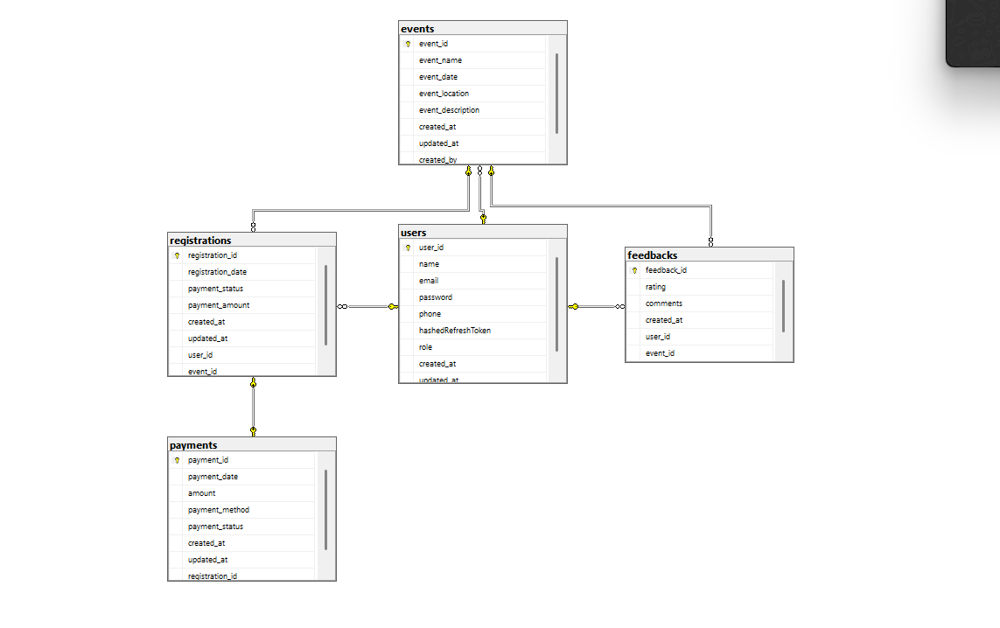

To execute this:

Open SQL Server Management Studio (SSMS)
Connect as an administrator (SA account)
Execute the above script


```SQL
USE [nest-conn]
GO

-- Create login if it doesn't exist
CREATE LOGIN [Tiff] WITH PASSWORD = 'PASSWORD'
GO

-- Create database user and assign permissions
CREATE USER [Tiff] FOR LOGIN [Tiff]
GO

ALTER ROLE db_owner ADD MEMBER [Tiff]
GO
```

Then update your .env file to use the proper credentials:

# Database Connection
DB_HOST=localhost
DB_PORT=1433
DB_USERNAME=Tifany Nyawira
DB_PASSWORD=PASSWORD
# ...rest of the file remains the same...


After making these changes:

Restart your SQL Server service
Restart your NestJS application


1. First, create your initial migration by running:

``` bash
pnpm run migration:generate src/migrations/InitialMigration
```

This will:

Create a new migration file in the src/migrations directory
Name it with a timestamp followed by "InitialMigration"
Generate the SQL needed based on your entity definitions
2. After generating the migration, run it with:
   
```bash
pnpm run migration:run
```
3. If you want to check the current migration status, you can use:

```bash
pnpm run migration:show
```

Make sure:

Your database connection is properly configured
Your database server is running
All your entities are properly defined and imported in your application

## End result:


