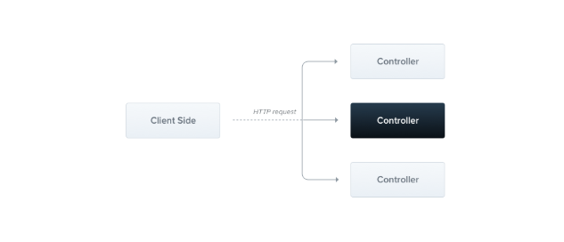

# Controllers

Controllers are responsible for handling incoming **requests** and sending **responses** back to the client.



A controller's purpose is to handle specific requests for the application. The **routing** mechanism determines which controller will handle each request. Often, a controller has multiple routes, and each route can perform a different action.

To create a basic controller, we use classes and  **decorators** . Decorators link classes with the necessary metadata, allowing Nest to create a routing map that connects requests to their corresponding controllers.

## Routing

In the following example, we’ll use the `@Controller()` decorator, which is **required** to define a basic controller. We'll specify an optional route path prefix of `cats`. Using a path prefix in the `@Controller()` decorator helps us group related routes together and reduces repetitive code. For example, if we want to group routes that manage interactions with a cat entity under the `/cats` path, we can specify the `cats` path prefix in the `@Controller()` decorator. This way, we don't need to repeat that portion of the path for each route in the file.

**cats.controller.ts****JS**

```typescript

import { Controller, Get } from '@nestjs/common';

@Controller('cats')
export class CatsController {
  @Get()
  findAll(): string {
    return 'This action returns all cats';
  }
}
```

> **Hint🤔** To create a controller using the CLI, simply execute the `nest g controller [name]` command.

#### Request object

Handlers often need access to the client’s **request** details. Nest provides access to the [request object](https://expressjs.com/en/api.html#req) from the underlying platform (Express by default). You can access the request object by instructing Nest to inject it using the `@Req()` decorator in the handler’s signature.

**cats.controller.ts****JS**

```typescript

import { Controller, Get, Req } from '@nestjs/common';
import { Request } from 'express';

@Controller('cats')
export class CatsController {
  @Get()
  findAll(@Req() request: Request): string {
    return 'This action returns all cats';
  }
}
```

> **Hint** To take advantage of `express` typings (like in the `request: Request` parameter example above), make sure to install the `@types/express` package.
>
> he request object represents the HTTP request and contains properties for the query string, parameters, HTTP headers, and body (read more [here](https://expressjs.com/en/api.html#req)). In most cases, you don't need to manually access these properties. Instead, you can use dedicated decorators like `@Body()` or `@Query()`, which are available out of the box. Below is a list of the provided decorators and the corresponding platform-specific objects they represent.
>
> | `@Request(), @Req()`      | `req`                                 |
> | --------------------------- | --------------------------------------- |
> | `@Response(), @Res()`*    | `res`                                 |
> | `@Next()`                 | `next`                                |
> | `@Session()`              | `req.session`                         |
> | `@Param(key?: string)`    | `req.params` / `req.params[key]`    |
> | `@Body(key?: string)`     | `req.body` / `req.body[key]`        |
> | `@Query(key?: string)`    | `req.query` / `req.query[key]`      |
> | `@Headers(name?: string)` | `req.headers` / `req.headers[name]` |
> | `@Ip()`                   | `req.ip`                              |
> | `@HostParam()`            | `req.hosts`                           |
>
> ^* ^For compatibility with typings across underlying HTTP platforms (e.g., Express and Fastify), Nest provides `@Res()` and `@Response()` decorators. `@Res()` is simply an alias for `@Response()`. Both directly expose the underlying native platform `response` object interface. When using them, you should also import the typings for the underlying library (e.g., `@types/express`) to take full advantage. Note that when you inject either `@Res()` or `@Response()` in a method handler, you put Nest into **Library-specific mode** for that handler, and you become responsible for managing the response. When doing so, you must issue some kind of response by making a call on the `response` object (e.g., `res.json(...)` or `res.send(...)`), or the HTTP server will hang.

#### Resources

Earlier, we defined an endpoint to fetch the cats resource (**GET** route). We'll typically also want to provide an endpoint that creates new records. For this, let's create the **POST** handler:

**cats.controller.ts****JS**

```typescript

import { Controller, Get, Post } from '@nestjs/common';

@Controller('cats')
export class CatsController {
  @Post()
  create(): string {
    return 'This action adds a new cat';
  }

  @Get()
  findAll(): string {
    return 'This action returns all cats';
  }
}
```

It's that simple. Nest provides decorators for all of the standard HTTP methods: `@Get()`, `@Post()`, `@Put()`, `@Delete()`, `@Patch()`, `@Options()`, and `@Head()`. In addition, `@All()` defines an endpoint that handles all of them.

#### Status code

As mentioned, the default **status code** for responses is always  **200** , except for POST requests, which default to  **201** . You can easily change this behavior by using the `@HttpCode(...)` decorator at the handler level.

```typescript

@Post()
@HttpCode(204)
create() {
  return 'This action adds a new cat';
}
```

> **Hint** Import `HttpCode` from the `@nestjs/common` package.

#### Redirection

To redirect a response to a specific URL, you can either use a `@Redirect()` decorator or a library-specific response object (and call `res.redirect()` directly).

`@Redirect()` takes two arguments, `url` and `statusCode`, both are optional. The default value of `statusCode` is `302` (`Found`) if omitted.

```typescript

@Get()
@Redirect('https://nestjs.com', 301)
```

> **Hint**Sometimes you may want to determine the HTTP status code or the redirect URL dynamically. Do this by returning an object following the `HttpRedirectResponse` interface (from `@nestjs/common`).

Returned values will override any arguments passed to the `@Redirect()` decorator. For example:

```typescript

@Get('docs')
@Redirect('https://docs.nestjs.com', 302)
getDocs(@Query('version') version) {
  if (version && version === '5') {
    return { url: 'https://docs.nestjs.com/v5/' };
  }
}
```

#### Route parameters

Routes with static paths won’t work when you need to accept **dynamic data** as part of the request (e.g., `GET /cats/1` to get the cat with id `1`). To define routes with parameters, you can add route parameter **tokens** in the route path to capture the dynamic values from the URL. The route parameter token in the `@Get()` decorator example below illustrates this approach. These route parameters can then be accessed using the `@Param()` decorator, which should be added to the method signature.

> **Hint**Routes with parameters should be declared after any static paths. This prevents the parameterized paths from intercepting traffic destined for the static paths.

```typescript

@Get(':id')
findOne(@Param() params: any): string {
  console.log(params.id);
  return `This action returns a #${params.id} cat`;
}
```

The `@Param()` decorator is used to decorate a method parameter (in the example above, `params`), making the **route** parameters accessible as properties of that decorated method parameter inside the method. As shown in the code, you can access the `id` parameter by referencing `params.id`. Alternatively, you can pass a specific parameter token to the decorator and directly reference the route parameter by name within the method body.

> **Hint**Import `Param` from the `@nestjs/common` package.

```typescript

@Get(':id')
findOne(@Param('id') id: string): string {
  return `This action returns a #${id} cat`;
}
```

#### Full resource sample

Below is an example that demonstrates the use of several available decorators to create a basic controller. This controller provides a few methods to access and manipulate internal data.

```typescript
import {
  Body,
  Controller,
  Delete,
  Get,
  Param,
  ParseIntPipe,
  Post,
  Put,
  Query,
  Redirect,
} from '@nestjs/common';
// import { AppService } from './app.service';
interface IEmployee {
  id: number;
  name: string;
  age: number;
  department: string;
}

@Controller('employees')
export class AppController {
  // constructor(private readonly appService: AppService) {}
  private employees: IEmployee[] = [
    {
      id: 1,
      name: 'John Doe',
      age: 30,
      department: 'IT',
    },
    {
      id: 2,
      name: 'Jane Doe',
      age: 25,
      department: 'HR',
    },
    {
      id: 3,
      name: 'John Smith',
      age: 35,
      department: 'Finance',
    },
  ];

  @Get() // http://localhost:3000/employees
  findAll(): IEmployee[] {
    return this.employees;
  }

  @Get() // http://localhost:3000/employees?name=John
  search(@Query('name') name: string): IEmployee[] {
    return this.employees.filter((e) => e.name.toLowerCase().includes(name));
  }

  @Get(':id') // http://localhost:3000/employees/1
  findOne(@Param('id', ParseIntPipe) idParam: number): IEmployee | string {
    const employee = this.employees.find((e) => e.id === idParam);
    if (!employee) {
      return `Employee with id: ${idParam} not found`;
    }
    return employee;
  }

  @Post() // http://localhost:3000/employees
  create(@Body() data: Partial<IEmployee>): IEmployee {
    const lastId = this.employees[this.employees.length - 1].id;
    const newEmployee = {
      id: lastId + 1,
      name: data.name!,
      age: data.age!,
      department: data.department!,
    };
    this.employees.push(newEmployee);
    return newEmployee;
  }

  @Put(':id') // http://localhost:3000/employees/1
  update(
    @Body() data: Partial<IEmployee>,
    @Param('id', ParseIntPipe) param: number,
  ): IEmployee | string {
    const employee = this.employees.find((e) => e.id === param);
    if (!employee) {
      return `Employee with id: ${param} not found`;
    }
    if (data.name) {
      employee.name = data.name;
    } else if (data.age) {
      employee.age = data.age;
    } else if (data.department) {
      employee.department = data.department;
    } else {
      return employee;
    }
    return employee;
  }

  @Delete(':id') // http://localhost:3000/employees/1
  delete(@Param('id', ParseIntPipe) params: number): string {
    const index = this.employees.findIndex((e) => e.id === params);
    this.employees.splice(index, 1);
    return `Employee with id: ${index} deleted`;
  }

  @Get('redirect') //  Redirect to /employees
  @Redirect('http://localhost:3000/employees')
  redirect(): string {
    return 'Redirected to /employees';
  }
}

```