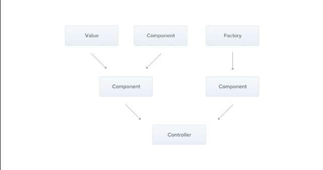

### Providers

Providers are a core concept in Nest. Many of the basic Nest classes, such as **services**, **repositories**, **factories**, and **helpers**, can be treated as providers. The key idea behind a provider is that it can be **injected** as a dependency, allowing objects to form various relationships with each other. The responsibility of "wiring up" these objects is largely handled by the Nest runtime system.



In the previous chapter, we created a simple `CatsController`. Controllers should handle HTTP requests and delegate more complex tasks to  **providers** . Providers are plain JavaScript classes declared as `providers` in a NestJS module. For more details, refer to the "Modules" chapter.

> **Hint** Since Nest enables you to design and organize dependencies in an object-oriented manner, we strongly recommend following the [SOLID principles](https://en.wikipedia.org/wiki/SOLID).

#### Services

Let's begin by creating a simple `CatsService`. This service will handle data storage and retrieval, and it will be used by the `CatsController`. Because of its role in managing the application's logic, it’s an ideal candidate to be defined as a provider.

**cats.service.ts****JS**

```typescript

import { Injectable } from '@nestjs/common';
import { Cat } from './interfaces/cat.interface';

@Injectable()
export class CatsService {
  private readonly cats: Cat[] = [];

  create(cat: Cat) {
    this.cats.push(cat);
  }

  findAll(): Cat[] {
    return this.cats;
  }
}
```

> **Hint** To create a service using the CLI, simply execute the `$ nest g service cats` command.

Our `CatsService` is a basic class with one property and two methods. The key addition here is the `@Injectable()` decorator. This decorator attaches metadata to the class, signaling that `CatsService` is a class that can be managed by the Nest [IoC](https://en.wikipedia.org/wiki/Inversion_of_control) container.

Additionally, this example makes use of a `Cat` interface, which likely looks something like this:

**interfaces/cat.interface.ts****JS**

```typescript

export interface Cat {
  name: string;
  age: number;
  breed: string;
}
```

Now that we have a service class to retrieve cats, let's use it inside the `CatsController`:

**cats.controller.ts****JS**

```typescript

import { Controller, Get, Post, Body } from '@nestjs/common';
import { CreateCatDto } from './dto/create-cat.dto';
import { CatsService } from './cats.service';
import { Cat } from './interfaces/cat.interface';

@Controller('cats')
export class CatsController {
  constructor(private catsService: CatsService) {}

  @Post()
  async create(@Body() createCatDto: CreateCatDto) {
    this.catsService.create(createCatDto);
  }

  @Get()
  async findAll(): Promise<Cat[]> {
    return this.catsService.findAll();
  }
}
```

The `CatsService` is **injected** through the class constructor. Notice the use of the `private` keyword. This shorthand allows us to both declare and initialize the `catsService` member in the same line, streamlining the process.

#### Dependency injection

Nest is built around the powerful design pattern known as  **Dependency Injection** . We highly recommend reading a great article about this concept in the official [Angular documentation](https://angular.dev/guide/di).

In Nest, thanks to TypeScript's capabilities, managing dependencies is straightforward because they are resolved based on their type. In the example below, Nest will resolve the `catsService` by creating and returning an instance of `CatsService` (or, in the case of a singleton, returning the existing instance if it has already been requested elsewhere). This dependency is then injected into your controller's constructor (or assigned to the specified property):

```typescript
constructor(private catsService: CatsService) {}
```

#### Scopes

Providers typically have a lifetime ("scope") that aligns with the application lifecycle. When the application is bootstrapped, each dependency must be resolved, meaning every provider gets instantiated. Similarly, when the application shuts down, all providers are destroyed. However, it’s also possible to make a provider  **request-scoped** , meaning its lifetime is tied to a specific request rather than the application's lifecycle. You can learn more about these techniques in the [Injection Scopes](https://docs.nestjs.com/fundamentals/injection-scopes) chapter.