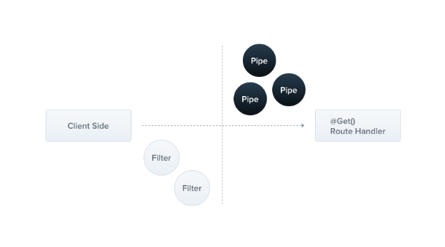

### Pipes

A pipe is a class annotated with the `@Injectable()` decorator, which implements the `PipeTransform` interface.



Pipes have two typical use cases:

* **transformation** : transform input data to the desired form (e.g., from string to integer)
* **validation** : evaluate input data and if valid, simply pass it through unchanged; otherwise, throw an exception

In both cases, pipes operate on the `arguments` being processed by a [controller route handler](https://docs.nestjs.com/controllers#route-parameters). Nest interposes a pipe just before a method is invoked, and the pipe receives the arguments destined for the method and operates on them. Any transformation or validation operation takes place at that time, after which the route handler is invoked with any (potentially) transformed arguments.

Nest comes with a number of built-in pipes that you can use out-of-the-box. You can also build your own custom pipes. In this chapter, we'll introduce the built-in pipes and show how to bind them to route handlers. We'll then examine several custom-built pipes to show how you can build one from scratch.


> **Hint** Pipes run inside the exceptions zone. This means that when a Pipe throws an exception it is handled by the exceptions layer (global exceptions filter and any [exceptions filters](https://docs.nestjs.com/exception-filters) that are applied to the current context). Given the above, it should be clear that when an exception is thrown in a Pipe, no controller method is subsequently executed. This gives you a best-practice technique for validating data coming into the application from external sources at the system boundary.

#### Built-in pipes

Nest comes with several pipes available out-of-the-box:

* `ValidationPipe`
* `ParseIntPipe`
* `ParseFloatPipe`
* `ParseBoolPipe`
* `ParseArrayPipe`
* `ParseUUIDPipe`
* `ParseEnumPipe`
* `DefaultValuePipe`
* `ParseFilePipe`
* `ParseDatePipe`

They're exported from the `@nestjs/common` package.

Let's take a quick look at using `ParseIntPipe`. This is an example of the **transformation** use case, where the pipe ensures that a method handler parameter is converted to a JavaScript integer (or throws an exception if the conversion fails). Later in this chapter, we'll show a simple custom implementation for a `ParseIntPipe`. The example techniques below also apply to the other built-in transformation pipes (`ParseBoolPipe`, `ParseFloatPipe`, `ParseEnumPipe`, `ParseArrayPipe`, `ParseDatePipe`, and `ParseUUIDPipe`, which we'll refer to as the `Parse*` pipes in this chapter).


#### Binding pipes

To use a pipe, we need to bind an instance of the pipe class to the appropriate context. In our `ParseIntPipe` example, we want to associate the pipe with a particular route handler method, and make sure it runs before the method is called. We do so with the following construct, which we'll refer to as binding the pipe at the method parameter level:


This ensures that one of the following two conditions is true: either the parameter we receive in the `findOne()` method is a number (as expected in our call to `this.catsService.findOne()`), or an exception is thrown before the route handler is called.

For example, assume the route is called like:

```bash

GET localhost:3000/abc
```

Nest will throw an exception like this:

```json

{
  "statusCode": 400,
  "message": "Validation failed (numeric string is expected)",
  "error": "Bad Request"
}
```

The exception will prevent the body of the `findOne()` method from executing.

In the example above, we pass a class (`ParseIntPipe`), not an instance, leaving responsibility for instantiation to the framework and enabling dependency injection. As with pipes and guards, we can instead pass an in-place instance. Passing an in-place instance is useful if we want to customize the built-in pipe's behavior by passing options:


Binding the other transformation pipes (all of the **Parse*** pipes) works similarly. These pipes all work in the context of validating route parameters, query string parameters and request body values.

For example with a query string parameter:


Here's an example of using the `ParseUUIDPipe` to parse a string parameter and validate if it is a UUID.


>
> **Hint** When using `ParseUUIDPipe()` you are parsing UUID in version 3, 4 or 5, if you only require a specific version of UUID you can pass a version in the pipe options.

Above we've seen examples of binding the various `Parse*` family of built-in pipes. Binding validation pipes is a little bit different; we'll discuss that in the following section.

> **Hint** Also, see [Validation techniques](https://docs.nestjs.com/techniques/validation) for extensive examples of validation pipes.

#### Custom pipes

As mentioned, you can build your own custom pipes. While Nest provides a robust built-in `ParseIntPipe` and `ValidationPipe`, let's build simple custom versions of each from scratch to see how custom pipes are constructed.

We start with a simple `ValidationPipe`. Initially, we'll have it simply take an input value and immediately return the same value, behaving like an identity function.

**validation.pipe.ts**

```typescript

import { PipeTransform, Injectable, ArgumentMetadata } from '@nestjs/common';

@Injectable()
export class ValidationPipe implements PipeTransform {
  transform(value: any, metadata: ArgumentMetadata) {
    return value;
  }
}
```

> **Hint** `PipeTransform<T, R>` is a generic interface that must be implemented by any pipe. The generic interface uses `T` to indicate the type of the input `value`, and `R` to indicate the return type of the `transform()` method.

Every pipe must implement the `transform()` method to fulfill the `PipeTransform` interface contract. This method has two parameters:

* `value`
* `metadata`

The `value` parameter is the currently processed method argument (before it is received by the route handling method), and `metadata` is the currently processed method argument's metadata. The metadata object has these properties:


#### Schema based validation

Let's make our validation pipe a little more useful. Take a closer look at the `create()` method of the `CatsController`, where we probably would like to ensure that the post body object is valid before attempting to run our service method.


Let's focus in on the `createCatDto` body parameter. Its type is `CreateCatDto`:

**create-cat.dto.ts**

```typescript

export class CreateCatDto {
  name: string;
  age: number;
  breed: string;
}
```

We want to ensure that any incoming request to the create method contains a valid body. So we have to validate the three members of the `createCatDto` object. We could do this inside the route handler method, but doing so is not ideal as it would break the **single responsibility principle** (SRP).

Another approach could be to create a **validator class** and delegate the task there. This has the disadvantage that we would have to remember to call this validator at the beginning of each method.

How about creating validation middleware? This could work, but unfortunately, it's not possible to create **generic middleware** which can be used across all contexts across the whole application. This is because middleware is unaware of the  **execution context** , including the handler that will be called and any of its parameters.

This is, of course, exactly the use case for which pipes are designed. So let's go ahead and refine our validation pipe.


#### Class validator

> **Warning** The techniques in this section require TypeScript and are not available if your app is written using vanilla JavaScript.

Let's look at an alternate implementation for our validation technique.

Nest works well with the [class-validator](https://github.com/typestack/class-validator) library. This powerful library allows you to use decorator-based validation. Decorator-based validation is extremely powerful, especially when combined with Nest's **Pipe** capabilities since we have access to the `metatype` of the processed property. Before we start, we need to install the required packages:

```bash

npm i --save class-validator class-transformer
```

Once these are installed, we can add a few decorators to the `CreateCatDto` class. Here we see a significant advantage of this technique: the `CreateCatDto` class remains the single source of truth for our Post body object (rather than having to create a separate validation class).

**create-cat.dto.ts**

```typescript

import { IsString, IsInt } from 'class-validator';

export class CreateCatDto {
  @IsString()
  name: string;

  @IsInt()
  age: number;

  @IsString()
  breed: string;
}
```

> **Hint** Read more about the class-validator decorators [here](https://github.com/typestack/class-validator#usage).

Now we can create a `ValidationPipe` class that uses these annotations.


#### Global scoped pipes

Since the `ValidationPipe` was created to be as generic as possible, we can realize its full utility by setting it up as a **global-scoped** pipe so that it is applied to every route handler across the entire application.

content_copy**main.ts****JS**

```typescript

async function bootstrap() {
  const app = await NestFactory.create(AppModule);
  app.useGlobalPipes(new ValidationPipe());
  await app.listen(process.env.PORT ?? 3000);
}
bootstrap();
```

> **Notice** In the case of [hybrid apps](https://docs.nestjs.com/faq/hybrid-application) the `useGlobalPipes()` method doesn't set up pipes for gateways and microservices. For "standard" (non-hybrid) microservice apps, `useGlobalPipes()` does mount pipes globally.

Global pipes are used across the whole application, for every controller and every route handler.

Note that in terms of dependency injection, global pipes registered from outside of any module (with `useGlobalPipes()` as in the example above) cannot inject dependencies since the binding has been done outside the context of any module. In order to solve this issue, you can set up a global pipe **directly from any module** using the following construction:

**app.module.ts**

```typescript

import { Module } from '@nestjs/common';
import { APP_PIPE } from '@nestjs/core';

@Module({
  providers: [
    {
      provide: APP_PIPE,
      useClass: ValidationPipe,
    },
  ],
})
export class AppModule {}
```

> **Hint** When using this approach to perform dependency injection for the pipe, note that regardless of the module where this construction is employed, the pipe is, in fact, global. Where should this be done? Choose the module where the pipe (`ValidationPipe` in the example above) is defined. Also, `useClass` is not the only way of dealing with custom provider registration. Learn more [here](https://docs.nestjs.com/fundamentals/custom-providers).


#### The built-in ValidationPipe

As a reminder, you don't have to build a generic validation pipe on your own since the `ValidationPipe` is provided by Nest out-of-the-box. The built-in `ValidationPipe` offers more options than the sample we built in this chapter, which has been kept basic for the sake of illustrating the mechanics of a custom-built pipe. You can find full details, along with lots of examples [here](https://docs.nestjs.com/techniques/validation).


#### Transformation use case

Validation isn't the only use case for custom pipes. At the beginning of this chapter, we mentioned that a pipe can also **transform** the input data to the desired format. This is possible because the value returned from the `transform` function completely overrides the previous value of the argument.

When is this useful? Consider that sometimes the data passed from the client needs to undergo some change - for example converting a string to an integer - before it can be properly handled by the route handler method. Furthermore, some required data fields may be missing, and we would like to apply default values. **Transformation pipes** can perform these functions by interposing a processing function between the client request and the request handler.

Here's a simple `ParseIntPipe` which is responsible for parsing a string into an integer value. (As noted above, Nest has a built-in `ParseIntPipe` that is more sophisticated; we include this as a simple example of a custom transformation pipe).

**parse-int.pipe.ts**

```typescript

import { PipeTransform, Injectable, ArgumentMetadata, BadRequestException } from '@nestjs/common';

@Injectable()
export class ParseIntPipe implements PipeTransform<string, number> {
  transform(value: string, metadata: ArgumentMetadata): number {
    const val = parseInt(value, 10);
    if (isNaN(val)) {
      throw new BadRequestException('Validation failed');
    }
    return val;
  }
}
```

We can then bind this pipe to the selected param as shown below:

```typescript

@Get(':id')
async findOne(@Param('id', new ParseIntPipe()) id) {
  return this.catsService.findOne(id);
}
```

Another useful transformation case would be to select an **existing user** entity from the database using an id supplied in the request:


```typescript

@Get(':id')
findOne(@Param('id', UserByIdPipe) userEntity: UserEntity) {
  return userEntity;
}
```

We leave the implementation of this pipe to the reader, but note that like all other transformation pipes, it receives an input value (an `id`) and returns an output value (a `UserEntity` object). This can make your code more declarative and [DRY](https://en.wikipedia.org/wiki/Don%27t_repeat_yourself) by abstracting boilerplate code out of your handler and into a common pipe.

#### Providing defaults

`Parse*` pipes expect a parameter's value to be defined. They throw an exception upon receiving `null` or `undefined` values. To allow an endpoint to handle missing querystring parameter values, we have to provide a default value to be injected before the `Parse*` pipes operate on these values. The `DefaultValuePipe` serves that purpose. Simply instantiate a `DefaultValuePipe` in the `@Query()` decorator before the relevant `Parse*` pipe, as shown below:


```typescript

@Get()
async findAll(
  @Query('activeOnly', new DefaultValuePipe(false), ParseBoolPipe) activeOnly: boolean,
  @Query('page', new DefaultValuePipe(0), ParseIntPipe) page: number,
) {
  return this.catsService.findAll({ activeOnly, page });
}
```